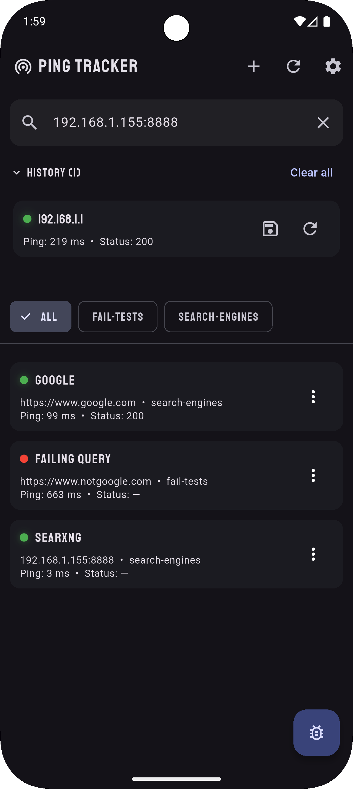
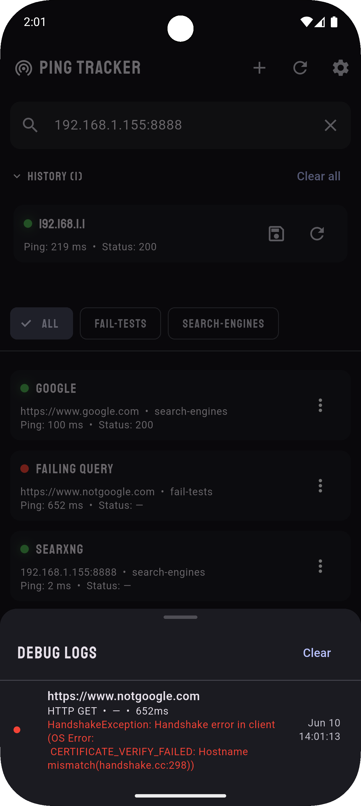

# Ping Tracker

A simple and elegant Android app to monitor network connections to your preferred IPs and hosts.

## Screenshots

  
  

## Features

- **Quick Health Checks** — Instantly check if a host or IP is reachable with a single tap
- **Persistent Monitoring** — Add your favorite hosts to keep track of them automatically
- **Group Organization** — Organize hosts into custom groups for easy filtering and management
- **Real-Time Status** — See live status with color-coded indicators and response times
- **Debug Logs** — Access detailed logs and error messages for troubleshooting connection issues
- **Dark Mode** — Comfortable viewing in any lighting condition
- **Clean, Modern UI** — Material Design 3 with smooth animations and haptic feedback

## Installation

Download the latest APK from the [Releases](https://github.com/kraibse/ping_tracker/releases) page and install it on your Android device.

> **Note:** You may need to enable "Install from unknown sources" in your device settings.

## How to Use

1. **Quick Check** — Enter a URL or IP address in the search bar and tap the check button to see its status instantly
2. **Add to Watchlist** — Tap **+** in the top-right corner to add a host for continuous monitoring
3. **Organize with Groups** — Create custom groups (e.g., "Home", "Work", "VPS") to categorize your hosts
4. **Filter by Group** — Use the horizontal chip list to filter your watchlist by group
5. **View Logs** — Tap the bug icon in the bottom-right corner to see detailed debug logs for any failed checks
6. **Customize Settings** — Tap the gear icon to adjust the check interval and toggle dark mode

## Requirements

- Android 5.0 (API 21) or higher

## Development

This app is built with [Flutter](https://flutter.dev) using Material 3 design and local storage via Hive.

For development setup and build instructions, see the project wiki or open an issue.

## License

This project is licensed under the MIT License — see the [LICENSE](LICENSE) file for details.
